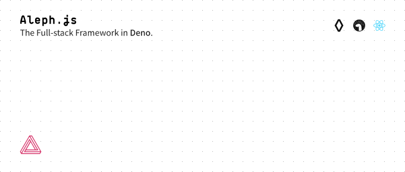

[](https://alephjs.org)

<p>
  <a href="https://alephjs.org">Website</a> |
  <a href="https://alephjs.org/docs/get-started">Get Started</a> |
  <a href="https://alephjs.org/docs">Docs</a> |
  <a href="./CONTRIBUTING.md">Contributing</a>
</p>

<p>
  <a href="https://discord.gg/pWGdS7sAqD"></a>
  <a href="https://twitter.com/intent/follow?screen_name=alephjs"></a>
</p>

<details>
  <summary>Boom</summary>
  <p>

  ```bash
  # get started
  $ deno run -A https://deno.land/x/aleph/install.ts
  $ aleph -h
  ```

  </p>
</details>
