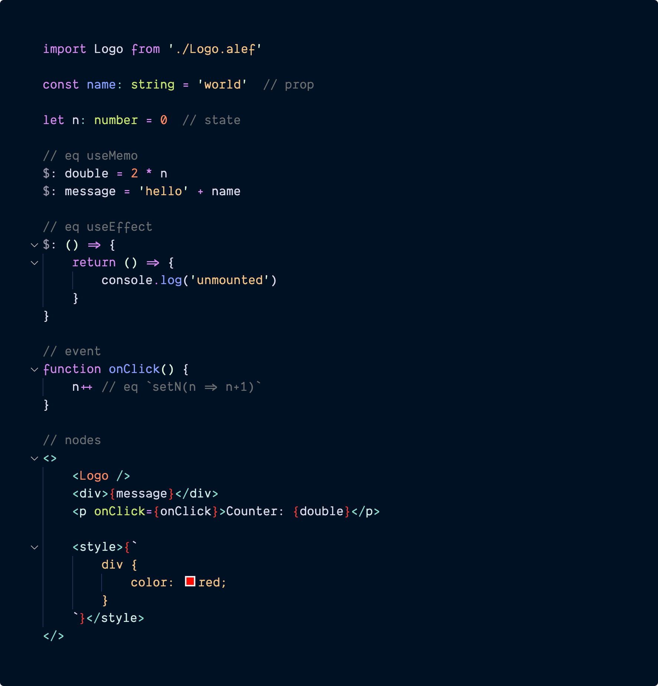

# Alef Component Concept

Alef Component for Aleph.js in **v0.4**:

- Born in Typescript
- With Standard JSX Syntax
- AOT Compile in Rust
- No Virtual DOM
- Zero Runtime
- Reactive
- Builtin Routing
- Support SSR

